# GPA Calculator App
A GPA Calculator was designed to help students calculate their semester and cumulative GPAs, enabling them to track their academic progress throughout their five years of study.

## About
A GPA Calculator was designed to help students in the Faculty of Petroleum and Minning Engineering at Suez University (specifically Petroleum Exploration and Production Engineering) calculate their semester and cumulative GPAs, enabling them to track their academic progress throughout their five years of study.

## Calculate Semester GPA
You can select the semester you want to calculate the GPA at and insert each subject degree you get the total GPA for that semester.

  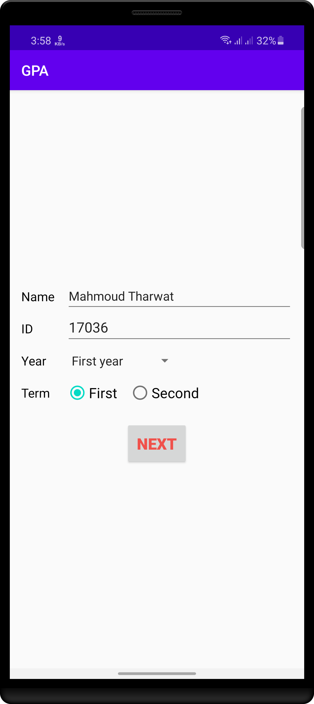
  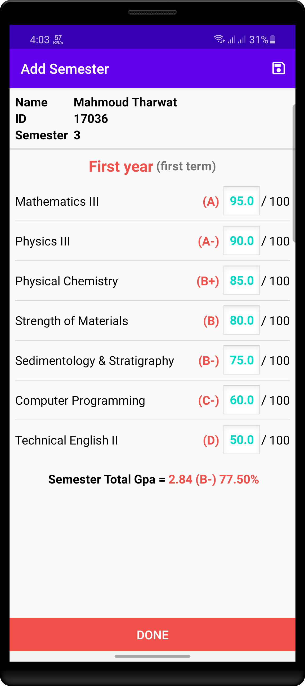
  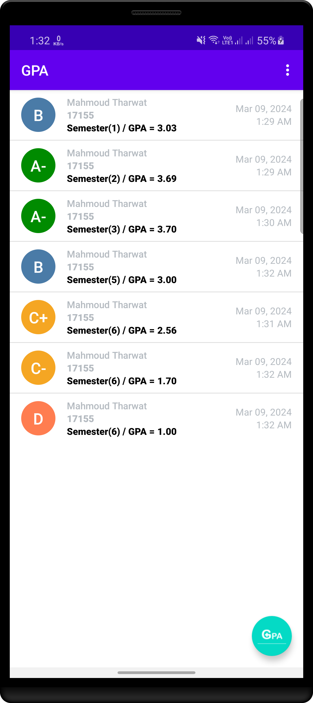

## Calculate Cumulative GPA
After calculating your GPA in each semester you can select the semesters you want to get your cumulative GPA at

  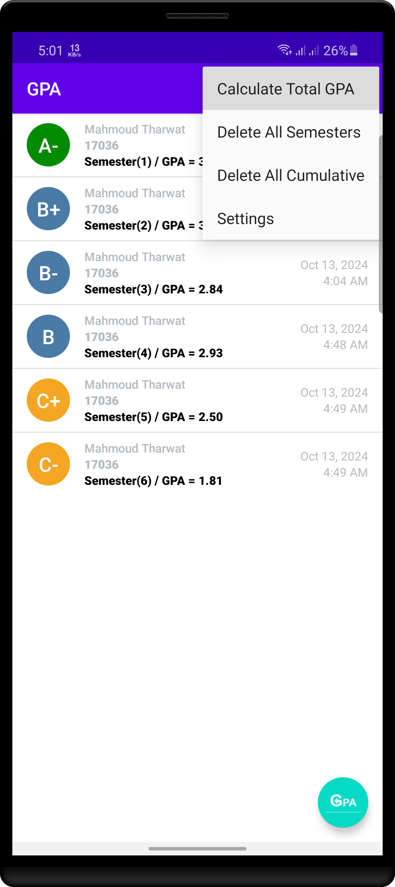
  
  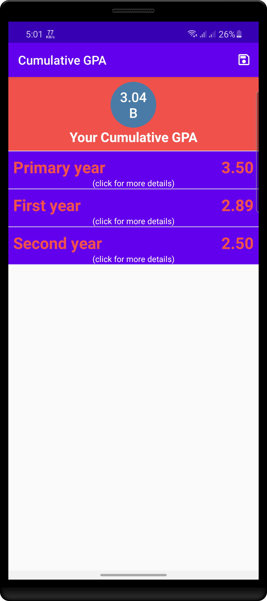
  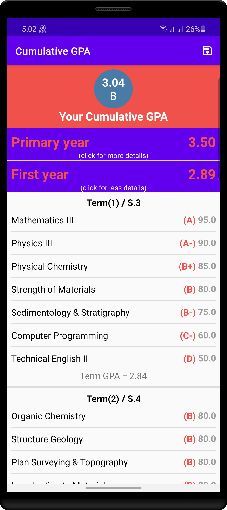
  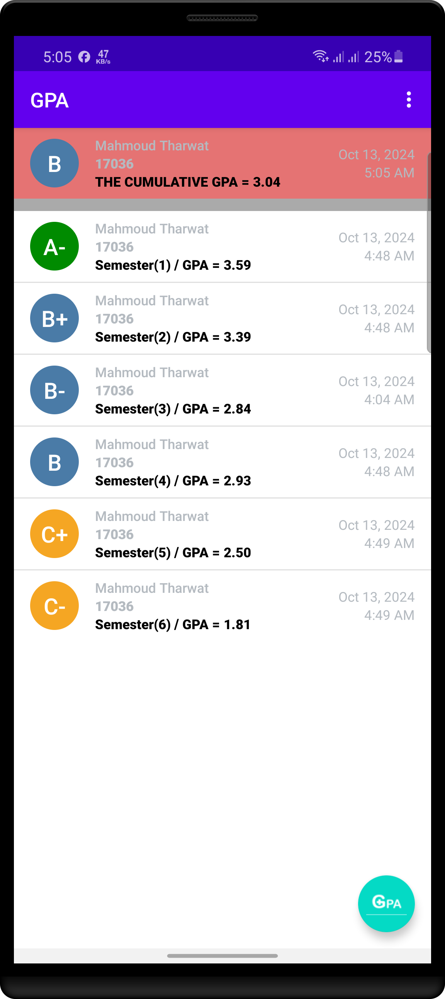

## Edit and Delete Semester Data
You can update or edit any semester by updating the subject degree

  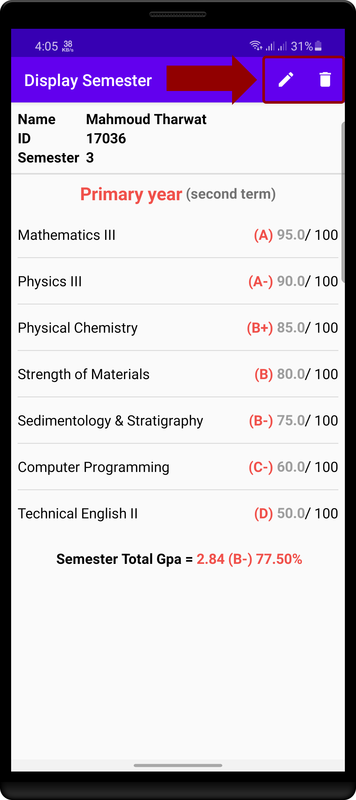

## Settings Section
1. The student can change his name and academic id.
2. The student can change the subject language that appears in the app between (English & Arabic).
3. Show how the GPA calculation is done.
4. Show subject information for each semester (subject hours and success degree).
5. Show the subject's order (the subject you must study before studying others).

  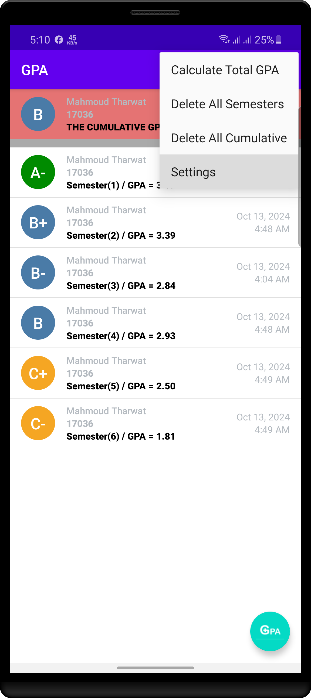
  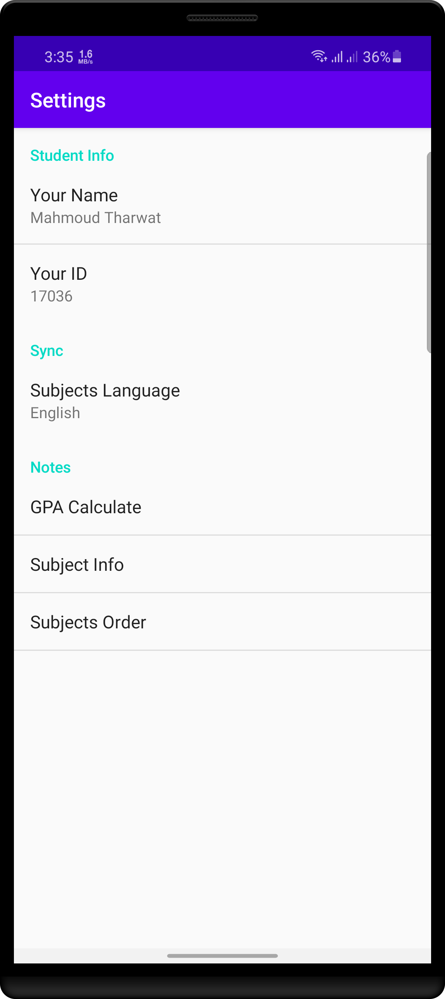
  
  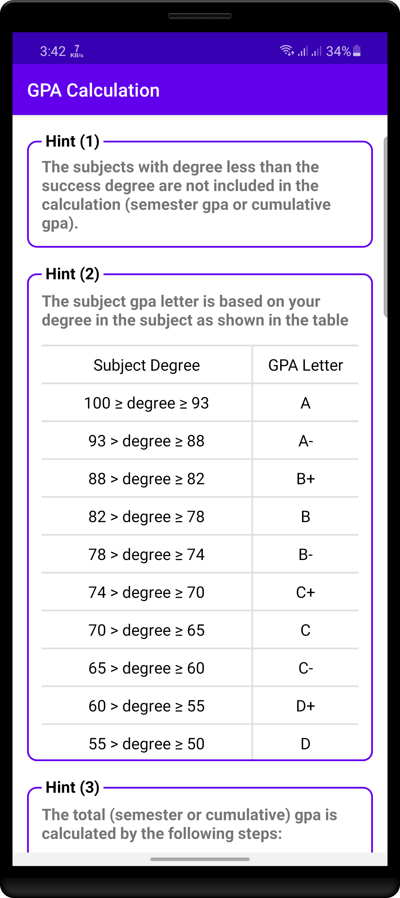
  
  
  

## Download
You can download the app from [here.](https://raw.githubusercontent.com/m-tharwat262/PetroleumProduction/master/apk/gpa_calculator_apk.apk)

